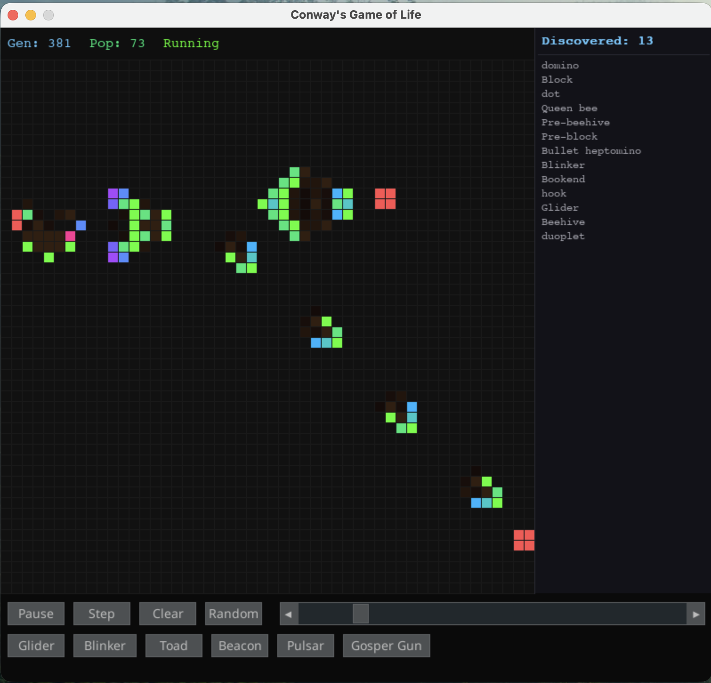

# Conway's Game of Life

A visual implementation of Conway's Game of Life built with Pygame, featuring age-based cell coloring, death trails, and automatic pattern recognition from the LifeWiki database.




## Features

- **50x50 grid** with click/drag cell editing when paused
- **Age-based coloring** -- cells shift from neon green through cyan, blue, violet, and into warm red as they age
- **Death trails** -- recently died cells leave a fading ember glow
- **Built-in presets** -- Glider, Blinker, Toad, Beacon, Pulsar, Gosper Gun
- **Pattern recognition** -- automatically identifies known patterns from a database of 914 small patterns (from 3,557 LifeWiki `.cells` files), matching all 8 orientations (rotations + reflections)
- **Scrollable discovery sidebar** -- right panel tracks unique pattern types found during a session, with mouse wheel scrolling and a scrollbar when the list overflows
- **Pattern detail popup** -- click any discovered pattern name to see a centered overlay visualizing its cell layout
- **Toast notifications** -- brief popups when a new pattern type is first discovered
- **Run persistence** -- save game runs (starting grid + discovered patterns) to a local SQLite database, browse and reload past runs for deterministic replay
- **Cumulative pattern stats** -- tracks all-time pattern discovery frequency across runs, with scrollable and clickable stat list in the run browser
- **XDG-compliant storage** -- game data stored at `~/.local/share/conway-game-of-life/game_data.db`

## Getting Started

### Prerequisites

- Python 3.13+
- [uv](https://docs.astral.sh/uv/) package manager

### Clone and Run

```bash
git clone https://github.com/7robots/conway-game-of-life.git
cd conway-game-of-life
./run.sh
```

This will install dependencies and launch the game. You can also run manually with `uv run python conway.py`.

## Controls

| Input | Action |
|-------|--------|
| **Space** | Start / Pause simulation |
| **N** | Step one generation |
| **C** | Clear grid |
| **R** | Randomize grid |
| **Click / Drag** | Toggle cells (when paused) |
| **Click pattern name** | Open pattern detail popup |
| **Scroll wheel** (sidebar) | Scroll discovery list |
| **Escape** | Close pattern popup / run browser |
| **Speed slider** | Adjust simulation speed (10-500ms) |
| **Preset buttons** | Load a preset pattern |
| **Save Run** | Save current run to database |
| **Browse** | Open run browser to view/load/delete saved runs |

## How Pattern Recognition Works

1. **At startup**: all `.cells` files with bounding box <= 10x10 are loaded. Each pattern is hashed in all 8 orientations (4 rotations x 2 reflections) into a lookup dictionary (~4,700 hash entries).
2. **Each generation**: alive cells are grouped into connected components via BFS flood fill (8-connectivity). Each component with bbox <= 10x10 is normalized to origin, hashed, and looked up in O(1).
3. **Result**: pattern scanning is O(grid_size) per generation regardless of database size.

Touching patterns merge into a single component and won't match individually -- this is intentional to avoid false positives.

## Project Structure

```
conway.py          -- Main application, grid logic, UI, game loop
pattern_db.py      -- .cells file parser, orientation hashing, PatternDatabase class
pattern_scanner.py -- BFS flood fill, connected component extraction, hash lookup
pattern_ui.py      -- Discovery sidebar and toast notification rendering
game_db.py         -- SQLite persistence for runs and pattern statistics
run_browser.py     -- Modal overlay for browsing/loading saved runs
patterns/          -- 3,557 .cells + 4,968 .rle files from conwaylife.com
```

## Pattern Database

The `patterns/` directory contains pattern files sourced from the [LifeWiki](https://conwaylife.com/wiki/). Only `.cells` format files with a bounding box of 10x10 or smaller are loaded into the recognition database (914 patterns). This covers all common still lifes, oscillators, and spaceships.

## License

Pattern files in `patterns/` are from [conwaylife.com](https://conwaylife.com/) and are used under fair use for educational purposes.
